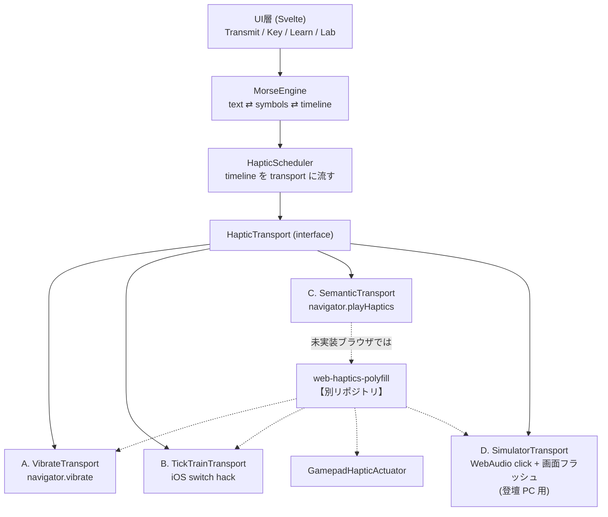

# web-haptics-api-demo 設計書

モールス信号を「振動」で送受信する Web アプリ。
Web Haptics API（提案中）の勉強会 10 分 LT のデモ台として設計する。

- 参考ライブラリ: [web-haptics (lochie)](https://github.com/lochie/web-haptics) / https://haptics.lochie.me/
- 対象 API: [WICG/web-haptics](https://github.com/WICG/web-haptics) / [MSEdgeExplainers Haptics explainer](https://github.com/MicrosoftEdge/MSEdgeExplainers/blob/main/Haptics/explainer.md)
- ポリフィルは**別リポジトリ**（`web-haptics-polyfill`）で作る前提

---

## スコープの変更（2026-09 時点）

**この文書は当初「モールス信号アプリ」として書かれたもので、実装スコープは変わっています。**

実際に作ったのは以下の 2 つで、いずれも `apps/web` の 1 ページに載っています:

- **触覚ノッチ付きスライダー** — API が想定する使い方（§ 正の例）
- **触覚あてゲーム / 神経衰弱** — 4 エフェクトの組み合わせで語彙を作る

会場同期バイブは「フロントエンドのみ」の方針により見送りました（Durable Objects が必要なため）。
モールスは実装しませんが、**「この API では原理的に打てない」という分析は LT のオチとして生きている**ので、
以下の § 2 はそのまま背景資料として残してあります。

### 調査で判明し、当初の記述を訂正した点

一次資料（[MDN browser-compat-data](https://github.com/mdn/browser-compat-data) の生 JSON、
[WICG/proposals#262](https://github.com/WICG/proposals/issues/262)、blink-dev）に当たった結果:

| 項目 | 訂正内容 |
|---|---|
| **Firefox** | 16 で追加されたが **129 で削除済み**（2024/8）。Firefox Android は 79+ で `true` を返すが**振動しない** |
| **特徴検出** | `typeof navigator.vibrate === "function"` は**当てにならない**。§ 6.3 の「ユーザーに聞く」設計の根拠がより強くなった |
| **iframe** | Chrome 55 以降 **クロスオリジン iframe では振動しない**。スライドに埋め込むとデモが死ぬ |
| **標準化段階** | WICG proposal は 2026-01-30 起票、Chromium は **Intent to Prototype**。Origin Trial でも ship でもない |
| **iOS** | BCD の `safari_ios` は今も `false`。[#29166](https://github.com/mdn/browser-compat-data/issues/29166) の「iOS で動く」報告は switch ハックの誤認で、データは変更されずクローズ |

---

## 0. 3 行まとめ

1. モールス信号は **「持続時間」の言語**（短点 1 単位 / 長点 3 単位）。
2. Web Haptics API は **「意味」の API**（`hint` / `edge` / `tick` / `align` の 4 つだけ、duration なし）。
3. **だから playHaptics だけでは原理的にモールスが打てない。** この「できなさ」を可視化することが、この LT の山場であり、このアプリの存在理由。

「動くデモ」ではなく **「API の設計思想が見える対比装置」** を作る。

---

## 1. 前提整理: いま触覚 Web には 3 つのレイヤがある

| レイヤ | 実体 | 表現力 | 対応状況 |
|---|---|---|---|
| **L1: 生パターン** | `navigator.vibrate(pattern)` | ON/OFF の時間列。**duration を完全に制御できる** | Android Chrome ○ / **iOS Safari ✕** / デスクトップ ✕ |
| **L2: 意味エフェクト** | `navigator.playHaptics(effect, intensity)` | `hint`/`edge`/`tick`/`align` の 4 種のみ。**duration は指定できない** | **どのブラウザも未実装**（early ideation 段階） |
| **L3: 宣言的 CSS** | `@haptic <effect> <intensity>?` | CSS ルールがマッチし始めた瞬間に発火 | 未実装 |

### 1.1 L2/L3 の仕様（現時点）

```js
navigator.playHaptics(effect, intensity);
// effect: "hint" | "edge" | "tick" | "align"
// intensity: 0.0–1.0（省略時 1.0）
// 戻り値: 常に undefined
```

```css
button:active {
  scale: 0.95;
  @haptic align 0.8;
}
```

4 エフェクトの意味とプラットフォーム対応（explainer より、あくまで例示）:

| Web Haptics | 意味 | Windows | macOS | iOS | Android |
|---|---|---|---|---|---|
| `hint` | 触れられる / 何か起きそう、という軽い予告 | hover | generic | light impact | gesture_threshold_deactivate |
| `edge` | 範囲の端・限界に当たった | collide | generic | soft impact | long_press |
| `tick` | 離散的な変化（リスト送り、トグル） | step | generic | selection | segment_frequent_tick |
| `align` | 何かがピタッとはまった | align | alignment | rigid impact | segment_tick |

### 1.2 設計上、効いてくる 2 つの決定

**(a) `playHaptics` は常に `undefined` を返す。**
「効いたか」も「対応しているか」も一切分からない。フィンガープリンティング対策として意図的にそうしている。
→ **アプリ側は「対応判定」を諦め、代わりに「ユーザーに聞く」しかない。** § 6.3 のキャリブレーション画面はこの制約から必然的に導かれる。

**(b) sticky user activation が必要（permission プロンプトは無い）。**
→ 一度ユーザーがタップすれば以降は自由に鳴らせる。「▶ 再生」ボタンさえあれば、そのあとの自動再生シーケンスは通る。

### 1.3 web-haptics (lochie) が実際にやっていること

このライブラリのソースを読むと、**現実の Web で触覚を出す 2 つのハック**が入っている。ポリフィル設計の土台になるので明示しておく。

**ハック 1: PWM による擬似 intensity**
`navigator.vibrate` に強度の概念は無いので、**20ms フレームの ON/OFF デューティ比**で強さを作っている。

```
frame = 20ms
on  = max(1, round(20 * intensity))
off = 20 - on
// intensity 0.5, duration 100ms → [10,10, 10,10, 10,10, 10,10, 10,10]
```

**ハック 2: iOS の `<input type="checkbox" switch>` を programmatic click**
iOS 17.4+ Safari では、この switch コントロールをトグルすると**本物の触覚 tick が 1 回鳴る**。web-haptics は非表示の `<label><input type="checkbox" switch></label>` を作り、`label.click()` を rAF ループで連打している。

```
tick 間隔 = 16 + (1 - intensity) * 184  [ms]
// intensity 1.0 → 16ms 間隔（約 62 tick/s）
// intensity 0.5 → 108ms 間隔
```

**→ ここが本アプリの設計を決定づける最重要事実:**
**iOS では「持続する振動」が作れない。作れるのは “tick の連打” だけ。**

---

## 2. 中心的な設計課題

### 2.1 モールスのタイミング（ITU-R M.1677-1）

単位時間を `u` として:

| 要素 | 長さ |
|---|---|
| 短点 (dit) | **1u ON** |
| 長点 (dah) | **3u ON** |
| 符号内ギャップ | 1u OFF |
| 文字間ギャップ | 3u OFF |
| 語間ギャップ | 7u OFF |

`u[ms] = 1200 / WPM`（PARIS 基準）。

**触覚向けのチューニング（音とは最適値が違う）:**

- 音のモールスは 20 WPM (u=60ms) が普通だが、**触覚は立ち上がりが遅い**。
- ERM モーターは spin-up/spin-down に 20–50ms かかる → 60ms の短点は「ぼやけた振動」になり長点と区別できない。
- LRA（近年のスマホはほぼこれ）は 5–10ms で立つので余裕はあるが、**皮膚の時間分解能**の問題が残る。
- **デフォルトは u = 100ms（12 WPM）を推奨。** 可変レンジ 60–250ms、初学者向けプリセット 150ms。

### 2.2 なぜ `playHaptics` でモールスが打てないのか

長点 = 3u ON = 300ms の**連続振動**。しかし `playHaptics("edge")` が実際にどれだけ振動するかは **OS が決める**（おそらく 10–30ms の単発インパクト）。指定する手段が無い。

つまり `playHaptics` で作れるのは:

- ✅ **オンセット（打ち始め）のリズム** — スケジューラで時刻を制御できる
- ❌ **持続時間（ON の長さ）** — 制御不能

**モールスは持続時間で情報を運ぶ言語なので、`playHaptics` 単体では情報が落ちる。**
これは API のバグではなく、**設計思想の帰結**である。Web Haptics API は「UI のフィードバック」のための API であって、「触覚チャネルでのデータ伝送」のための API ではない。

> **LT の主張:** API の境界は、境界を踏み抜いてみて初めて見える。モールスはそのための最短の踏み絵。

### 2.3 結論: 3 つの Transport を並走させる

| Transport | 基盤 | 短点 / 長点の作り方 | 忠実度 | 対応環境 |
|---|---|---|---|---|
| **A. Continuous** | `navigator.vibrate` | 1u ON / 3u ON（真の連続 ON） | ★★★ ITU 準拠 | Android Chrome |
| **B. TickTrain** | iOS switch hack | 1 tick / 3u 間 tick 連打 | ★★☆ 時間包絡は保つ、質感が違う | iOS 17.4+ Safari |
| **C. Semantic** | `navigator.playHaptics` | `tick` / `edge` | ★☆☆ リズムのみ、長さ無し | 未実装（ポリフィル経由） |

**この 3 つを同じメッセージで A/B できる画面を作る = LT のデモそのもの。**

---

## 3. アーキテクチャ

### 3.1 全体像



### 3.2 リポジトリ分割と依存の向き

| リポジトリ | 責務 |
|---|---|
| `infixer/web-haptics-api-demo` （本リポジトリ） | アプリ。モールスのドメインロジック + UI + デモ |
| `infixer/web-haptics-polyfill` （別途） | `navigator.playHaptics` / `--haptic` を生やすだけ。モールスを一切知らない |

**鉄則: アプリはポリフィルの関数を import しない。副作用 import 1 行だけ。**

```ts
// src/main.ts
import "web-haptics-polyfill";  // ← navigator.playHaptics を生やすだけ

// 以降アプリ内では素の標準 API しか呼ばない
navigator.playHaptics("tick", 0.6);
```

こうしておくと、**ブラウザが実装した日に import 1 行を消すだけで移行が完了する。**
LT でこのスライドを見せると「ポリフィルとは何か」が 5 秒で伝わる。

開発中のリンク方法:
```jsonc
// package.json
"dependencies": {
  "web-haptics-polyfill": "github:infixer/web-haptics-polyfill"
  // ローカル開発時は npm link / pnpm workspace で差し替え
}
```

### 3.3 ディレクトリ構成

```
web-haptics-api-demo/
├── docs/
│   ├── DESIGN.md          ← 本書
│   ├── TALK.md            ← 10分LTの進行台本
│   └── IDEAS.md           ← 他アプリ案
├── src/
│   ├── core/              ← フレームワーク非依存の純粋TS（ここが資産）
│   │   ├── morse/
│   │   │   ├── table.ts        国際モールス符号表（英数+和文カナ）
│   │   │   ├── encode.ts       text → Symbol[]
│   │   │   ├── decode.ts       Symbol[] → text（前方一致 + 曖昧一致）
│   │   │   └── timeline.ts     Symbol[] → Timeline（ON/OFF区間列）
│   │   ├── haptic/
│   │   │   ├── transport.ts    HapticTransport interface
│   │   │   ├── vibrate.ts      A
│   │   │   ├── ticktrain.ts    B
│   │   │   ├── semantic.ts     C
│   │   │   ├── simulator.ts    D
│   │   │   └── select.ts       能力検出 + 選択ロジック
│   │   ├── scheduler.ts        Timeline を再生（chunk分割・キャンセル・進捗）
│   │   └── keyer.ts            打鍵入力 → Symbol[]（電鍵モード）
│   ├── ui/                ← Svelte コンポーネント
│   ├── routes/            ← 画面
│   └── main.ts
└── ...
```

`src/core/` はブラウザ API を直接叩かず、`HapticTransport` 越しにしか触らない。
→ **Node 上でユニットテストできる**（`FakeTransport` で発火時刻を記録して assert）。

### 3.4 技術選定

| 項目 | 選定 | 理由 |
|---|---|---|
| ビルド | **Vite** | 秒で立ち上がる。LT 中にライブ編集できる |
| 言語 | **TypeScript** | Timeline の型が設計そのものなので必須 |
| UI | **Svelte 5** | スライドに載せてもノイズが少ない。core は非依存なので後から差し替え可 |
| デプロイ | **GitHub Pages / Vercel** | 静的でよい |

> **⚠️ 開発時の落とし穴:** `navigator.vibrate` は **secure context 必須**。
> `vite --host` で LAN IP に実機からアクセスすると **http なので振動しない**。
> `@vitejs/plugin-basic-ssl` か Cloudflare Quick Tunnel / ngrok を必ず用意すること。
> **これで 30 分溶かすのが定番なので、LT 前日までに実機確認を済ませる。**

---

## 4. コア: 型設計

設計の骨格はここに集約される。

```ts
// core/morse/encode.ts
type Symbol = "dit" | "dah" | "gapIntra" | "gapChar" | "gapWord";

// core/morse/timeline.ts
/** 1 区間。ON/OFF と長さ（ms）と、由来（UIハイライト用） */
interface Span {
  on: boolean;
  ms: number;
  /** 由来の文字インデックス（デコード表示のハイライトに使う） */
  charIndex: number;
  /** dit / dah のときのみ */
  kind?: "dit" | "dah";
}

interface Timeline {
  spans: Span[];
  totalMs: number;
  unitMs: number;
}

function toTimeline(symbols: Symbol[], unitMs: number): Timeline;
```

**Timeline を中間表現に置いたことが本設計の要。**
Timeline さえあれば、振動にも・音にも・画面のフラッシュにも・LED にも同じものを流せる。
Transport は「Timeline をどう解釈するか」だけが違う。

```ts
// core/haptic/transport.ts
interface HapticTransport {
  readonly id: "vibrate" | "ticktrain" | "semantic" | "simulator";
  readonly label: string;

  /** この transport が真の duration を再現できるか（= モールス忠実度の指標） */
  readonly fidelity: "exact" | "envelope" | "onset-only";

  /** 再生。AbortSignal でキャンセル可能。完了で resolve */
  play(timeline: Timeline, signal: AbortSignal): Promise<void>;

  /** 単発（UI フィードバック用） */
  pulse(kind: "dit" | "dah" | "ui-tick", intensity: number): void;
}
```

**注意: `available()` や `isSupported` を interface に置かない。**
Web Haptics API の思想（対応可否は観測できない）に合わせ、**能力検出ではなく “ユーザーに聞く” 設計**にする（§ 6.3）。
`navigator.vibrate` の有無だけは `typeof` で分かるので、それは**初期値の推定**にのみ使い、最終決定はユーザーに委ねる。

---

## 5. Transport 別 実装方針

### 5.1 A. VibrateTransport（Android / 最高忠実度）

Timeline → `vibrate` の配列は自明に落ちる。

```ts
// Timeline は必ず ON で始まり ON/OFF が交互 → [on, off, on, off, ...] そのもの
// 'A' = ・－ , u=100ms  →  [100, 100, 300]
navigator.vibrate(spans.map(s => s.ms));
```

**⚠️ 設計上の重要な決定: intensity PWM を使わない（intensity は常に 1.0 固定）。**

web-haptics の PWM は「UI の軽いタップ」には最適だが、**モールスには有害**。
300ms の長点を `intensity 0.5` で流すと `[10,10]×15` に刻まれ、
**「長い ON」ではなく「ざらついたブルブル」になり、短点との対比が消える。**
モールスは duration のコントラストが全てなので、ここは 100% ON で打ち切る。

> これは実際に web-haptics のソースを読んで気づいた点で、LT の「ライブラリをそのまま使うとハマる話」として使える。

**実装上の注意:**
- Blink は個々の duration をクランプ（〜10s）し、**パターン配列長にも上限**がある（100 要素弱／要実測）。
  20 文字 × 約 9 要素 ≒ 180 要素で**普通に超える**。→ **チャンク分割必須。**
- `vibrate()` を再度呼ぶと**前のパターンは即座にキャンセルされる**。
  → スケジューラは「チャンク境界ちょうど」で次を投げる必要がある。安全のため **チャンク末尾を OFF で終える + 数十 ms のマージン**を持たせる。
- ページが非表示になると Chrome は振動を止める → `visibilitychange` で pause 扱いにする。

```ts
// スケジューラ: 約 2 秒ごとのチャンクに割り、setTimeout で継投
const CHUNK_MS = 2000;
```

### 5.2 B. TickTrainTransport（iOS / 包絡のみ保持）

iOS には連続 ON が無い。**「ON 区間を tick で塗りつぶす」**。

```ts
// ON 区間 (ms) を TICK_INTERVAL ごとの tick 連打で表現
const TICK_INTERVAL = 25;  // 16ms が下限だが iOS 側スロットリングを考えて余裕をとる
// 短点 100ms → 4 tick
// 長点 300ms → 12 tick  ← 「長い」が “ざらつきの持続” として伝わる
```

これを **テクスチャ符号化** と呼ぶ。ITU の時間包絡はそのまま保たれる。

**代替モード（アクセシビリティ / 初学者向け）: カウント符号化**
- 短点 = tick 1 発、長点 = tick 2 発（`・` と `‥` の触覚版）
- ITU タイミングは崩れるが**圧倒的に覚えやすい**。学習モードのデフォルトはこちら。

> 設定に `iOS 長点表現: [テクスチャ | カウント]` を出す。
> **この設定項目の存在自体が「iOS には持続振動が無い」ことの説明になる**ので、LT で開いて見せる。

**要検証（実機必須）:**
- `display:none` の switch を click しても触覚が出るか（web-haptics はそう実装している）
- 連打時の iOS 側スロットリング閾値
- サイレントモード / 低電力モードでの挙動
- **iOS 17.4 未満では何も起きない** → フォールバックは Simulator

### 5.3 C. SemanticTransport（Web Haptics API / オンセットのみ）

```ts
// 短点 → tick（軽い離散変化）
// 長点 → edge（重い、限界に当たる感じ）
// 語間  → align（区切りが「はまる」）
navigator.playHaptics(span.kind === "dah" ? "edge" : "tick",
                      span.kind === "dah" ? 1.0 : 0.5);
```

- OFF 区間はスケジューラの待ち時間として消化する。
- **完了通知が無い**（返り値 undefined）ので、`play()` の Promise は**スケジューラの理論時刻**で resolve するしかない。実際の振動と乖離しうる、と UI に明示する。
- `fidelity: "onset-only"` を UI に出し、**「これは “モールス” ではなく “モールスのリズム” です」**とラベルする。

**このラベルこそが LT の主張の可視化。**

### 5.4 D. SimulatorTransport（登壇 PC 用 / 必須）

**登壇者の MacBook には触覚が無い。会場に伝えるには視覚と聴覚に変換するしかない。**

- **音**: web-haptics 同様、ホワイトノイズ × 指数減衰を bandpass に通した「コツッ」音。
  ただしモールスでは **ON 区間は持続音**（600Hz サイン波）にした方が短点/長点の差が伝わる。
  → 「触覚シミュレータ」ではなく **「触覚の可聴化」** と位置づける。
- **視覚**: Timeline を横スクロールする**タイムラインバー**と、画面全体の**フラッシュ**。
- **Gamepad**: `GamepadHapticActuator.playEffect("dual-rumble", {duration, strongMagnitude})` が
  **デスクトップでも本物の触覚を出せる唯一の手段**。
  → **登壇時に Switch Pro コン / DualSense を USB 接続し、客席に回す**のはかなり強い。

```ts
// duration を直接指定できるので、実はモールス忠実度は "exact"
gamepad.vibrationActuator.playEffect("dual-rumble", {
  duration: span.ms, strongMagnitude: 1.0, weakMagnitude: 0.0,
});
```

> 皮肉として面白い: **「持続時間を指定できる標準 API」は Gamepad API の方**。
> Web Haptics API はそれを意図的に捨てている。LT のオチに使える。

---

## 6. ポリフィル側（別リポジトリ）の設計

アプリ側の要求として、ポリフィルに求める仕様をここで固めておく。

### 6.1 公開面

```ts
// 副作用 import のみ。既に native があれば何もしない
if (!("playHaptics" in navigator)) {
  Object.defineProperty(Navigator.prototype, "playHaptics", {
    value(effect: HapticEffect, intensity = 1.0): undefined {
      /* ... */
      return undefined;   // ← 仕様どおり必ず undefined
    },
    writable: true, configurable: true, enumerable: false,
  });
}
```

**仕様への忠実さを最優先する。**
「対応しているか返す」「Promise を返す」等の**便利拡張を足さない**。
足した瞬間、それは polyfill ではなく別ライブラリになり、native 移行時に壊れる。

### 6.2 フォールバック梯子

上から順に、使えるものを使う:

| 順位 | 手段 | duration 制御 | 環境 |
|---|---|---|---|
| 0 | native `navigator.playHaptics` | — | 将来 |
| 1 | `navigator.vibrate` + PWM | ○ | Android Chrome |
| 2 | `<input switch>` click | ✕ (tick のみ) | iOS 17.4+ Safari |
| 3 | `GamepadHapticActuator.playEffect` | ○ | デスクトップ + コントローラ |
| 4 | WebAudio click + 視覚フラッシュ | — | どこでも（開発/登壇用、`{debug:true}` 時のみ） |

4 エフェクトの実装マッピング（`navigator.vibrate` 系での例）:

| effect | duration | PWM intensity | 意図 |
|---|---|---|---|
| `hint` | 10ms | 0.3 | ほぼ気配 |
| `tick` | 12ms | 0.6 | はっきりした 1 発 |
| `align` | 15ms | 1.0 | 硬く鋭い |
| `edge` | 35ms | 0.9 | 重く止まる |

（web-haptics の `selection` / `rigid` / `heavy` / `soft` プリセットがほぼそのまま流用できる）

### 6.3 「対応判定できない」問題への回答＝キャリブレーション

`playHaptics` は成否を返さない。**それでもアプリは transport を選ばねばならない。**
→ **能力検出をやめ、ユーザーに 3 秒だけ聞く。**

```
┌────────────────────────────────┐
│  触覚のセットアップ                │
│                                │
│   [ ▶ テスト振動を再生 ]           │
│                                │
│   感じましたか？                   │
│   [ はっきり感じた ] [ 弱い ]       │
│   [ 何も感じない ]                 │
└────────────────────────────────┘
```

- 「はっきり感じた」→ その transport を採用、結果を `localStorage` に保存
- 「弱い」→ intensity / unitMs を上げて再テスト
- 「何も感じない」→ 梯子の次段へ。最終的に Simulator（音+視覚）へ落とす

> **これは “API の制約が UX を規定した” 好例で、LT でそのまま話せる。**
> プライバシー保護のために capability query を消した結果、
> **アプリは「ユーザーに聞く」という、より正直な設計に押し戻される。**

### 6.4 CSS `@haptic` はポリフィルできるか → **正しくは無理。代替を出す**

`@haptic` は未知の at-rule なので **CSSOM がパース時に捨てる**。JS からは見えない。

**代替案: カスタムプロパティに載せる。**

```css
@property --haptic {
  syntax: "*";
  inherits: false;     /* ← 継承させない。これが無いと子要素まで鳴る */
  initial-value: none;
}

button:active {
  scale: 0.95;
  --haptic: tick 0.8;   /* ← これは CSSOM に残り、getComputedStyle で読める */
}
```

ポリフィルは `getComputedStyle(el).getPropertyValue("--haptic")` を読んで発火する。

**「ルールがマッチし始めた瞬間」の検出**が本質的に難しいので、**よくあるケースだけ**を割り切ってカバーする:

| 対象 | 検出方法 |
|---|---|
| `:active` | `pointerdown` / `pointerup` |
| `:hover` | `pointerover`（デスクトップのみ） |
| `:focus-visible` | `focusin` |
| `:checked` | `change` |
| クラス付け替え | `MutationObserver`（`attributes: ["class"]`） |
| メディアクエリ / コンテナクエリ / `:has()` | **非対応**（正直に書く） |

**LT での使い方:** 「ポリフィルできる部分とできない部分がある」ことを見せると、
**なぜ CSS の機能はブラウザ実装が必要なのか**が具体的に伝わる。ここは正直に「無理」と言った方が刺さる。

---

## 7. 画面設計

### 7.1 `/transmit` — 送信

- テキスト入力 → リアルタイムに `・－` プレビュー
- `unitMs` スライダー（60–250ms、WPM 併記）
- Transport セレクタ（A/B/C/D）+ 現在の `fidelity` バッジ
- ▶ 再生 / ■ 停止、**進行中の文字をハイライト**
- 「今どこを打っているか」をタイムラインバーで可視化

### 7.2 `/key` — 電鍵

- 大きな押しっぱなしボタン。押した長さを計測 → dit/dah を判定
- **押している間、触覚がフィードバックされる**（`--haptic` のデモ場所）
- 離した長さでギャップを判定し、**リアルタイムにデコード**して文字を出す
- 適応的閾値: 直近の押下長の分布から dit/dah 境界を自動調整（固定閾値だと個人差で破綻する）

### 7.3 `/learn` — 触覚だけで読む

- **画面を伏せて**、1 文字ぶんの振動を再生 → 4 択で回答
- 正解 → `align`、不正解 → `edge` でフィードバック（**Web Haptics API の意味論がそのままハマる好例**）
- **これが会場参加型デモの本命。** 「今から震えます、何の文字か当ててください」

### 7.4 `/lab` — 比較ラボ（**LT のメイン画面**）

同じメッセージ（例: `SOS`）を **3 つの transport で連続再生**し、体感差を作る。

```
┌──────────────────────────────────────────┐
│  "SOS"  u=120ms                          │
├──────────────────────────────────────────┤
│ A  vibrate      [exact]      ▶  ███ ███  │
│ B  tick train   [envelope]   ▶  ┃┃┃ ┃┃┃  │
│ C  playHaptics  [onset-only] ▶  │ │ │    │
├──────────────────────────────────────────┤
│ ⓘ C は長点の「長さ」を表現できません。      │
│   Web Haptics API に duration が無いため。 │
└──────────────────────────────────────────┘
```

**この画面ひとつで LT の主張が完結する。ここに一番時間をかける。**

### 7.5 （任意・強い）`/sync` — 会場同期バイブ

登壇者が打つと、**会場全員のスマホが同時に震える**。

- 実装: 小さな WebSocket サーバ（Cloudflare Workers + Durable Objects / Deno Deploy）
- 各端末は `unitMs` と開始時刻（サーバ時刻基準）だけ受け取り、**ローカルで Timeline を再生**
  → パケットごとに送るとジッタで崩壊する。**「開始時刻の合意」だけ取るのが正解。**
- 参加は QR コードで
- **ただしスコープが跳ねるので stretch goal。**§ 8 のロードマップでは最後。

---

## 8. 実装ロードマップ

LT を締切に置いた優先順位。**上から順に、途中で止めても LT が成立する**ように並べてある。

| # | 内容 | 状態 | 目安 |
|---|---|---|---|
| 1 | `core/morse`（表・encode・timeline）+ ユニットテスト | 必須 | 半日 |
| 2 | `VibrateTransport` + Scheduler（チャンク分割・キャンセル） | 必須 | 半日 |
| 3 | `/transmit` 画面（最小 UI） | 必須 | 半日 |
| 4 | `SimulatorTransport`（音 + 視覚） | **必須**（登壇 PC で見せるため） | 半日 |
| 5 | `/lab` 比較画面 | **必須**（LT の核） | 半日 |
| 6 | ポリフィル別リポジトリ（梯子 1・2・4 のみ） | 必須 | 1 日 |
| 7 | `SemanticTransport` + キャリブレーション | 必須 | 半日 |
| 8 | `TickTrainTransport` + **iOS 実機検証** | 高（会場に iPhone が多い） | 半日 |
| 9 | `/key` 電鍵 + `--haptic` デモ | 中 | 半日 |
| 10 | `/learn` 学習モード | 中（参加型デモとして強い） | 半日 |
| 11 | Gamepad 対応 | 低（余裕があれば。ウケは良い） | 数時間 |
| 12 | `/sync` 会場同期 | stretch | 1 日 |

**LT 3 日前までに 1–8 を終え、残り時間は全部リハーサルと実機確認に回す。**

---

## 9. リスク・落とし穴チェックリスト

- [ ] **secure context**: LAN の http では振動しない。HTTPS 開発サーバを用意したか
- [ ] **iOS 実機**: 17.4 未満だと switch hack が効かない。会場想定の端末で試したか
- [ ] **サイレント / 低電力モード**: iOS はマナーモードで触覚が止まる設定がある。**登壇前に必ず確認**
- [ ] **user activation**: 最初の 1 タップが無いと鳴らない。`/lab` に入った時点で「▶」を踏ませる導線があるか
- [ ] **vibrate のパターン長上限**: 長文でチャンク分割が効いているか。20 文字で実測したか
- [ ] **visibilitychange**: 画面を切り替えると止まる。再生中の状態管理は破綻しないか
- [ ] **PWM を長点に使っていないか**（§ 5.1 の罠）
- [ ] **登壇 PC のフォールバック**: 会場 Wi-Fi が死んでもデモが成立するか（全部静的にビルドしておく）
- [ ] **バッテリー**: 振動はかなり食う。デモ端末は満充電で

---

## 10. 参考

- [WICG/web-haptics](https://github.com/WICG/web-haptics) — 提案本体（early ideation）
- [MSEdgeExplainers / Haptics explainer](https://github.com/MicrosoftEdge/MSEdgeExplainers/blob/main/Haptics/explainer.md) — 動機・プラットフォームマッピング
- [WICG/proposals#262](https://github.com/WICG/proposals/issues/262) — 提案スレッド
- [lochie/web-haptics](https://github.com/lochie/web-haptics) — PWM と iOS switch hack の実装
- [MDN: GamepadHapticActuator](https://developer.mozilla.org/en-US/docs/Web/API/GamepadHapticActuator) — duration を持つ唯一の標準触覚 API
- [Feel the Web — Haptics API (BlinkOn 21)](https://liminzhu.github.io/BlinkOn21HapticsTalk/) — 提案者の発表
